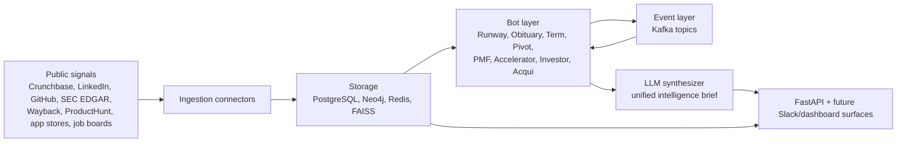

# StartupIntel

**Open-source startup intelligence, built from public signals.**

[](https://github.com/askmy-stack/startupintel/actions/workflows/ci-cd.yml)
[](LICENSE)
[](https://python.org)
[](https://fastapi.tiangolo.com)
[](https://www.postgresql.org)
[](https://neo4j.com)
[](https://groq.com)
[](https://github.com/facebookresearch/faiss)

StartupIntel is a production-ready startup intelligence platform that turns public startup signals into structured, cross-linked analysis. It features 8 specialized ML bots that ingest funding, headcount, hiring, product, graph, term sheet, PMF, and acquisition signals, then unify them into one intelligence layer with LLM-powered synthesis.

This repository now includes: full REST API, all 8 bot implementations, real data ingestion connectors, FAISS-based RAG retrieval, LLM clients for Groq/Ollama, Alembic migrations, comprehensive database seeding, and production-ready infrastructure.

## Why It Exists

Startup diligence is still too manual. Analysts jump between Crunchbase, LinkedIn, GitHub, job boards, app reviews, founder posts, SEC filings, and old post-mortems, then stitch the story together by hand.

StartupIntel is designed to make those signals composable:

- Normalize public signals into shared storage.
- Score startups with specialized bots.
- Write relationship context to a graph.
- Trigger downstream bots when one signal changes the risk picture.
- Generate a brief that explains what changed and why it matters.

## Current Status

The project is now production-ready with all core components implemented.

| Area | Status | Notes |
|---|---|---|
| FastAPI application | Complete | Full REST API with CORS, auth, error handling |
| CRUD endpoints (startups, investors, accelerators) | Complete | Pagination, search, filtering |
| All 8 bot scoring cores | Complete | Real signal fetching + LLM synthesis |
| Data ingestion connectors | Complete | Crunchbase, GitHub, LinkedIn, Twitter, ProductHunt, SEC EDGAR, Wayback, WHOIS, App Store, Job Boards |
| RAG & LLM | Complete | FAISS + sentence-transformers, Groq + Ollama clients |
| Database | Complete | Alembic migrations, comprehensive seeding script |
| Event streaming | Foundation | In-memory producer ready for Kafka upgrade |
| Authentication | Complete | JWT-based auth with configurable middleware |
| Docker infrastructure | Working | docker-compose.yml with Postgres, Neo4j, Redis |
| Airflow DAGs | Planned | Ready for implementation |
| Slack integration | Planned | Ready for implementation |

## Bot Roadmap

| Bot | Purpose | Status |
|---|---|---|
| RunwayBot | Detect financial stress from headcount, hiring, sentiment, domain, and funding signals | Scoring + events implemented |
| ObituaryBot | Match startups against historical failure patterns from post-mortems | Scoring + events implemented |
| TermBot | Decode term sheets and flag founder-unfriendly clauses | Clause scoring + events implemented |
| PivotBot | Reconstruct product and positioning pivots from public history | Scoring + events implemented |
| PMFBot | Detect PMF inflection from public traction signals | Scoring + changepoint events implemented |
| AcceleratorBot | Rank accelerators by outcome-adjusted ROI | ROI scoring implemented |
| InvestorBot | Score investor network value and centrality | Centrality scoring + graph projection implemented |
| AcquiBot | Predict acqui-hire probability and likely acquirers | Probability scoring + acquirer ranking implemented |

## Architecture



## Tech Stack

| Layer | Tooling |
|---|---|
| API | FastAPI, Uvicorn, Pydantic |
| Primary database | PostgreSQL 16, SQLAlchemy async |
| Graph database | Neo4j 5.x |
| Cache and lightweight queueing | Redis 7 |
| Event streaming roadmap | Kafka |
| Orchestration roadmap | Airflow |
| Retrieval roadmap | sentence-transformers, FAISS |
| ML roadmap | NetworkX, ruptures, XGBoost, PyTorch Geometric |
| LLM roadmap | Groq and Ollama |
| Quality | pytest, ruff, GitHub Actions |

## Quickstart

Clone and install:

```bash
git clone https://github.com/askmy-stack/startupintel.git
cd startupintel
python -m pip install -e ".[dev]"
```

Run tests:

```bash
pytest -q
ruff check .
```

Start the API:

```bash
uvicorn startupintel.api.main:app --reload
```

Try the demo endpoints:

```bash
curl http://localhost:8000/health
curl http://localhost:8000/startup/00000000-0000-0000-0000-000000000001/stress
```

Run the infrastructure stack:

```bash
cp .env.example .env
docker compose up -d
```

Seed sample data after Postgres is running:

```bash
python scripts/seed_database.py
```

## Configuration

All runtime configuration is read from `.env`. Start from `.env.example`.

Key groups:

- Database and infrastructure: `POSTGRES_URL`, `NEO4J_URL`, `REDIS_URL`, `KAFKA_BOOTSTRAP_SERVERS`
- LLM providers: `LLM_PROVIDER`, `GROQ_API_KEY`, `GROQ_MODEL`, `OLLAMA_BASE_URL`, `OLLAMA_MODEL`
- Retrieval: `EMBEDDING_MODEL`, `FAISS_INDEX_PATH`
- Data sources: `CRUNCHBASE_API_KEY`, `GITHUB_TOKEN`, `TWITTER_BEARER_TOKEN`, `PRODUCTHUNT_TOKEN`, `SEC_EDGAR_USER_AGENT`
- Bot thresholds and weights: `RUNWAY_WEIGHT_*`, `RUNWAY_HIGH_STRESS_THRESHOLD`

## API Surface

### Core Endpoints

| Method | Route | Description |
|---|---|---|
| `GET` | `/health` | Service health |
| `POST` | `/startup` | Create startup |
| `GET` | `/startup` | List startups (paginated) |
| `GET` | `/startup/search` | Search startups |
| `GET` | `/startup/{id}` | Get startup details |
| `PATCH` | `/startup/{id}` | Update startup |
| `DELETE` | `/startup/{id}` | Delete startup |

### Bot Analysis Endpoints

| Method | Route | Description |
|---|---|---|
| `GET` | `/startup/{id}/stress` | RunwayBot stress analysis |
| `GET` | `/startup/{id}/obituary` | ObituaryBot failure pattern matching |
| `GET` | `/startup/{id}/pmf` | PMFBot product-market fit analysis |
| `GET` | `/startup/{id}/pivot` | PivotBot pivot detection |
| `GET` | `/startup/{id}/acqui` | AcquiBot acqui-hire prediction |
| `POST` | `/startup/{id}/run/{bot_name}` | Manually trigger bot run |

### Investor Endpoints

| Method | Route | Description |
|---|---|---|
| `POST` | `/investor` | Create investor |
| `GET` | `/investor` | List investors |
| `GET` | `/investor/{id}` | Get investor details |
| `GET` | `/investor/{id}/network` | InvestorBot network analysis |
| `DELETE` | `/investor/{id}` | Delete investor |

### Accelerator Endpoints

| Method | Route | Description |
|---|---|---|
| `POST` | `/accelerator` | Create accelerator |
| `GET` | `/accelerator` | List accelerators |
| `GET` | `/accelerator/{id}` | Get accelerator details |
| `GET` | `/accelerator/{id}/ranking` | AcceleratorBot ROI ranking |
| `GET` | `/accelerator/rankings/top` | Top accelerators by ROI |

### Term Sheet Endpoints

| Method | Route | Description |
|---|---|---|
| `POST` | `/termsheet/analyze` | Analyze term sheet text |
| `POST` | `/termsheet/analyze-file` | Upload and analyze term sheet file |
| `POST` | `/termsheet/startup/{id}/analyze` | Analyze for specific startup |
| `GET` | `/termsheet/clauses/standards` | Market standard clause info |

### Bot Management Endpoints

| Method | Route | Description |
|---|---|---|
| `GET` | `/bot/status` | Bot system status |
| `GET` | `/bot/{name}/results` | Bot results history |
| `GET` | `/bot/{name}/stats` | Bot statistics |
| `GET` | `/bot/scores/recent` | Recent scores across all bots |

Interactive docs are available at `http://localhost:8000/docs` when the API is running.

### Authentication Endpoints

| Method | Route | Description |
|---|---|---|
| `POST` | `/api/auth/register` | Create account + organization |
| `POST` | `/api/auth/login` | Login with email/password |
| `POST` | `/api/auth/refresh` | Refresh access token |
| `GET` | `/api/auth/me` | Current user profile |
| `POST` | `/api/auth/api-keys` | Create API key |
| `GET` | `/api/auth/api-keys` | List API keys |

### File Upload Endpoints

| Method | Route | Description |
|---|---|---|
| `POST` | `/api/files/upload` | Upload file with virus scan |
| `GET` | `/api/files/` | List files |
| `GET` | `/api/files/{id}/download` | Download file |
| `GET` | `/api/files/{id}/thumbnail` | Get thumbnail |

### Export Endpoints

| Method | Route | Description |
|---|---|---|
| `GET` | `/api/export/startups/csv` | Export startups to CSV |
| `GET` | `/api/export/startups/json` | Export startups to JSON |
| `GET` | `/api/export/startup/{id}/report` | Export startup report |

### Search Endpoints

| Method | Route | Description |
|---|---|---|
| `GET` | `/api/startup/search` | Search startups (PostgreSQL) |
| `GET` | `/api/startup/search/fulltext` | Full-text search |

### Monitoring

| Endpoint | Description |
|---|---|
| `/metrics` | Prometheus metrics |
| `/api/health/live` | Liveness probe |
| `/api/health/ready` | Readiness probe |

## RunwayBot

RunwayBot is the first implemented bot. It normalizes five stress signals into a 0 to 100 score.

| Signal | Weight | Stress interpretation |
|---|---:|---|
| Headcount delta | 0.35 | Sharper 30-day decline increases stress |
| Job posting delta | 0.25 | Hiring slowdown increases stress |
| Founder sentiment | 0.20 | More negative sentiment increases stress |
| Domain renewal | 0.10 | Near-term expiry increases stress |
| Funding recency | 0.10 | More time since last raise increases stress |

Risk levels:

| Score | Level |
|---:|---|
| 0-25 | low |
| 26-50 | monitor |
| 51-75 | elevated |
| 76-100 | high |

High-stress results above `RUNWAY_HIGH_STRESS_THRESHOLD` emit `startup.stress.high`, which is designed to trigger PivotBot, ObituaryBot, and AcquiBot once the event workers exist.

## Repository Layout

```text
startupintel/
├── api/                    # FastAPI application
│   ├── dependencies/       # Auth, DB dependencies
│   ├── routes/             # API route handlers
│   ├── schemas/            # Pydantic models
│   └── main.py             # Application entry
├── bots/                   # Bot implementations
│   ├── base.py             # BaseBot abstract class
│   ├── runway_bot.py       # RunwayBot
│   ├── obituary_bot.py     # ObituaryBot
│   ├── pmf_bot.py          # PMFBot
│   ├── pivot_bot.py        # PivotBot
│   ├── acqui_bot.py        # AcquiBot
│   ├── investor_bot.py     # InvestorBot
│   └── accelerator_bot.py  # AcceleratorBot
├── db/                     # Database layer
│   ├── models.py           # SQLAlchemy models
│   ├── postgres.py         # PostgreSQL connection
│   ├── neo4j.py            # Neo4j connection
│   └── redis.py            # Redis connection
├── events/                 # Event streaming
│   ├── producer.py         # Event producer
│   └── topics.py           # Event definitions
├── ingestion/              # Data connectors
│   ├── crunchbase.py
│   ├── github.py
│   ├── linkedin.py
│   └── ...
├── llm/                    # LLM clients
│   ├── client.py
│   └── prompts.py
├── rag/                    # RAG system
│   ├── retriever.py
│   └── embeddings.py
├── utils/                  # Shared utilities
│   ├── auth.py             # JWT, passwords
│   ├── cache.py            # Redis caching
│   ├── circuit_breaker.py  # Resilience patterns
│   ├── elasticsearch.py    # Search client
│   ├── feature_flags.py    # Feature toggles
│   ├── logging_config.py   # Structured logging
│   ├── notifications.py    # Email/Slack
│   ├── retry.py            # Retry logic
│   └── storage.py          # File storage
├── config.py               # App configuration
├── tests/                  # Test suite
├── scripts/                # Utility scripts
├── docs/                   # Documentation
├── k8s/                    # Kubernetes manifests
└── monitoring/             # Prometheus config

Infrastructure:
├── docker-compose.yml      # Local development stack
├── Dockerfile              # Production image
└── .github/workflows/      # CI/CD pipelines
```

## Development

See [CONTRIBUTING.md](CONTRIBUTING.md) for detailed development guidelines.

Quick start:

```bash
git switch main
git pull
git switch -c feature/your-change
```

Before submitting PR:

```bash
ruff check .
pytest -q
```

## Security And Data Use

StartupIntel is intended for public and permissioned data sources only. Do not commit API keys, scraped private data, personal data dumps, or proprietary datasets. Use `.env` for local secrets and keep generated indexes or model binaries outside Git unless they are intentionally released artifacts.

## Roadmap

See [CHANGELOG.md](CHANGELOG.md) for version history and planned features.

### Completed

1. All 8 bot scoring cores with real signal fetching
2. Complete data ingestion connectors (Crunchbase, GitHub, LinkedIn, Twitter, ProductHunt, SEC EDGAR, Wayback, WHOIS, App Store, Job Boards)
3. FAISS-based RAG retrieval with sentence-transformers
4. LLM clients for Groq and Ollama
5. Full REST API with CRUD endpoints for startups, investors, accelerators
6. Alembic migration environment for all models
7. Comprehensive database seeding script
8. JWT-based authentication and security middleware

### Next Steps

1. Implement Kafka producer and consumer workers for event streaming
2. Build Airflow DAGs for scheduled bot runs
3. Add Slack bot integration for real-time alerts
4. Create unified brief synthesis combining all bot outputs
5. Add dashboard-ready response models and frontend surface
6. Enhance Neo4j graph projections for InvestorBot
7. Add SHAP summaries for AcquiBot model interpretability
8. Build real-time monitoring and alerting dashboards

## License

MIT. See [LICENSE](LICENSE).

## Disclaimer

StartupIntel is an independent open-source project and is not affiliated with Crunchbase, LinkedIn, GitHub, Neo4j, Groq, Ollama, ProductHunt, or any other data provider.
