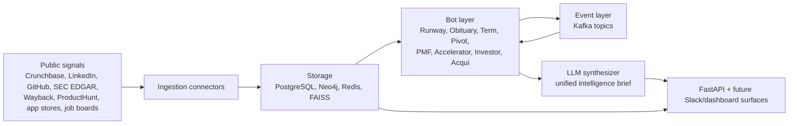

# StartupIntel

**Open-source startup intelligence, built from public signals.**

[](https://github.com/askmy-stack/startupintel/actions/workflows/ci.yml)
[](LICENSE)
[](https://python.org)
[](https://fastapi.tiangolo.com)
[](https://www.postgresql.org)
[](https://neo4j.com)

StartupIntel is a startup intelligence platform that turns public startup signals into structured, cross-linked analysis. The long-term goal is eight specialized bots that ingest funding, headcount, hiring, product, graph, term sheet, PMF, and acquisition signals, then unify them into one intelligence layer.

This repository currently ships the first working foundation: a FastAPI service, core database models, bot orchestration primitives, RunwayBot scoring, event topics, Docker setup, and tests.

## Why It Exists

Startup diligence is still too manual. Analysts jump between Crunchbase, LinkedIn, GitHub, job boards, app reviews, founder posts, SEC filings, and old post-mortems, then stitch the story together by hand.

StartupIntel is designed to make those signals composable:

- Normalize public signals into shared storage.
- Score startups with specialized bots.
- Write relationship context to a graph.
- Trigger downstream bots when one signal changes the risk picture.
- Generate a brief that explains what changed and why it matters.

## Current Status

The project is in foundation mode.

| Area | Status |
|---|---|
| FastAPI application | Working |
| `/health` endpoint | Working |
| Demo `/startup/{id}/stress` endpoint | Working |
| Core SQLAlchemy models | Working |
| Config from `.env` | Working |
| Base bot orchestration | Working |
| RunwayBot scoring | Working |
| High-stress event emission | Working with in-memory producer |
| PostgreSQL, Redis, Neo4j helpers | Scaffolded |
| Real ingestion connectors | Planned |
| Kafka workers | Planned |
| Airflow DAG bodies | Planned |
| Remaining seven bots | Planned |
| RAG corpus and LLM synthesis | Planned |

## Bot Roadmap

| Bot | Purpose | Status |
|---|---|---|
| RunwayBot | Detect financial stress from headcount, hiring, sentiment, domain, and funding signals | Foundation implemented |
| ObituaryBot | Match startups against historical failure patterns from post-mortems | Planned |
| TermBot | Decode term sheets and flag founder-unfriendly clauses | Planned |
| PivotBot | Reconstruct product and positioning pivots from public history | Planned |
| PMFBot | Detect PMF inflection from public traction signals | Planned |
| AcceleratorBot | Rank accelerators by outcome-adjusted ROI | Planned |
| InvestorBot | Score investor network value and centrality | Planned |
| AcquiBot | Predict acqui-hire probability and likely acquirers | Planned |

## Architecture



## Tech Stack

| Layer | Tooling |
|---|---|
| API | FastAPI, Uvicorn, Pydantic |
| Primary database | PostgreSQL 16, SQLAlchemy async |
| Graph database | Neo4j 5.x |
| Cache and lightweight queueing | Redis 7 |
| Event streaming roadmap | Kafka |
| Orchestration roadmap | Airflow |
| Retrieval roadmap | sentence-transformers, FAISS |
| ML roadmap | NetworkX, ruptures, XGBoost, PyTorch Geometric |
| LLM roadmap | Groq and Ollama |
| Quality | pytest, ruff, GitHub Actions |

## Quickstart

Clone and install:

```bash
git clone https://github.com/askmy-stack/startupintel.git
cd startupintel
python -m pip install -e ".[dev]"
```

Run tests:

```bash
pytest -q
ruff check .
```

Start the API:

```bash
uvicorn startupintel.api.main:app --reload
```

Try the demo endpoints:

```bash
curl http://localhost:8000/health
curl http://localhost:8000/startup/00000000-0000-0000-0000-000000000001/stress
```

Run the infrastructure stack:

```bash
cp .env.example .env
docker compose up -d
```

Seed sample data after Postgres is running:

```bash
python scripts/seed_database.py
```

## Configuration

All runtime configuration is read from `.env`. Start from `.env.example`.

Key groups:

- Database and infrastructure: `POSTGRES_URL`, `NEO4J_URL`, `REDIS_URL`, `KAFKA_BOOTSTRAP_SERVERS`
- LLM providers: `LLM_PROVIDER`, `GROQ_API_KEY`, `GROQ_MODEL`, `OLLAMA_BASE_URL`, `OLLAMA_MODEL`
- Retrieval: `EMBEDDING_MODEL`, `FAISS_INDEX_PATH`
- Data sources: `CRUNCHBASE_API_KEY`, `GITHUB_TOKEN`, `TWITTER_BEARER_TOKEN`, `PRODUCTHUNT_TOKEN`, `SEC_EDGAR_USER_AGENT`
- Bot thresholds and weights: `RUNWAY_WEIGHT_*`, `RUNWAY_HIGH_STRESS_THRESHOLD`

## API Surface

Implemented now:

| Method | Route | Description |
|---|---|---|
| `GET` | `/health` | Service health |
| `GET` | `/startup/{id}/stress` | Demo RunwayBot stress result |

Planned:

| Area | Routes |
|---|---|
| Startup intelligence | `/startup/{id}`, `/startup/{id}/brief`, `/startup/search` |
| Bot outputs | `/startup/{id}/obituary`, `/startup/{id}/pivot`, `/startup/{id}/pmf`, `/startup/{id}/acqui` |
| Term sheets | `/termsheet`, `/termsheet/{id}`, `/termsheet/benchmark` |
| Accelerators | `/accelerator/rankings`, `/accelerator/{id}`, `/accelerator/recommend` |
| Investors | `/investor/{id}`, `/investor/rankings`, `/investor/{id}/network`, `/investor/recommend` |

Interactive docs are available at `http://localhost:8000/docs` when the API is running.

## RunwayBot

RunwayBot is the first implemented bot. It normalizes five stress signals into a 0 to 100 score.

| Signal | Weight | Stress interpretation |
|---|---:|---|
| Headcount delta | 0.35 | Sharper 30-day decline increases stress |
| Job posting delta | 0.25 | Hiring slowdown increases stress |
| Founder sentiment | 0.20 | More negative sentiment increases stress |
| Domain renewal | 0.10 | Near-term expiry increases stress |
| Funding recency | 0.10 | More time since last raise increases stress |

Risk levels:

| Score | Level |
|---:|---|
| 0-25 | low |
| 26-50 | monitor |
| 51-75 | elevated |
| 76-100 | high |

High-stress results above `RUNWAY_HIGH_STRESS_THRESHOLD` emit `startup.stress.high`, which is designed to trigger PivotBot, ObituaryBot, and AcquiBot once the event workers exist.

## Repository Layout

```text
startupintel/
  api/              FastAPI app, schemas, routes
  bots/             BaseBot and bot implementations
  db/               SQLAlchemy models and database clients
  events/           Event topics and producers
  graph/            Neo4j schema helpers
  ingestion/        Connector interfaces
  llm/              LLM client abstractions
  rag/              Retriever abstractions and corpus folders
  scoring/          Shared scoring utilities
  airflow/          DAG package placeholder
  slack/            Slack integration placeholder
tests/
  test_api/
  test_bots/
scripts/
  seed_database.py
```

## Development

Create a branch from `main`:

```bash
git switch main
git pull
git switch -c codex/your-change
```

Install the pre-commit hooks once after setup:

```bash
pre-commit install
```

Run checks before opening a PR:

```bash
ruff check .
pytest -q
```

Expected PR shape:

- Keep changes scoped.
- Add or update tests for bot behavior, API routes, and scoring logic.
- Keep bot weights configurable through `.env`.
- Document new public endpoints and major signals in this README.

## Security And Data Use

StartupIntel is intended for public and permissioned data sources only. Do not commit API keys, scraped private data, personal data dumps, or proprietary datasets. Use `.env` for local secrets and keep generated indexes or model binaries outside Git unless they are intentionally released artifacts.

## Roadmap

1. Add real RunwayBot ingestion connectors.
2. Add Alembic migration environment for the core models.
3. Implement Kafka producer and consumer workers.
4. Build ObituaryBot corpus ingestion and FAISS retrieval.
5. Add TermBot PDF upload and clause scoring.
6. Implement PivotBot and PMFBot signal pipelines.
7. Add InvestorBot graph centrality scoring.
8. Add AcquiBot model loading, SHAP summaries, and acquirer matching.
9. Add unified brief synthesis and Slack digest.
10. Add dashboard-ready response models and frontend surface.

## License

MIT. See [LICENSE](LICENSE).

## Disclaimer

StartupIntel is an independent open-source project and is not affiliated with Crunchbase, LinkedIn, GitHub, Neo4j, Groq, Ollama, ProductHunt, or any other data provider.
